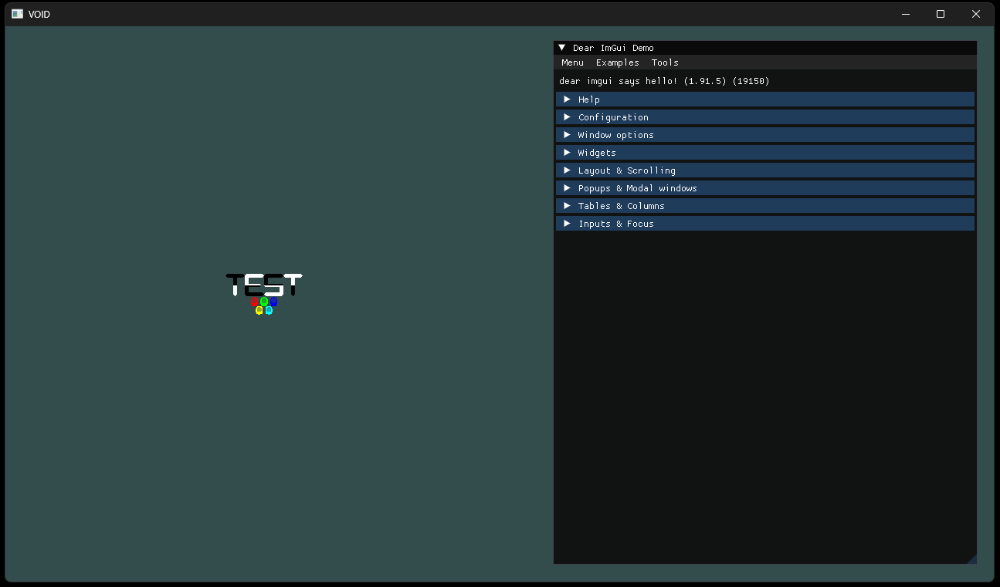
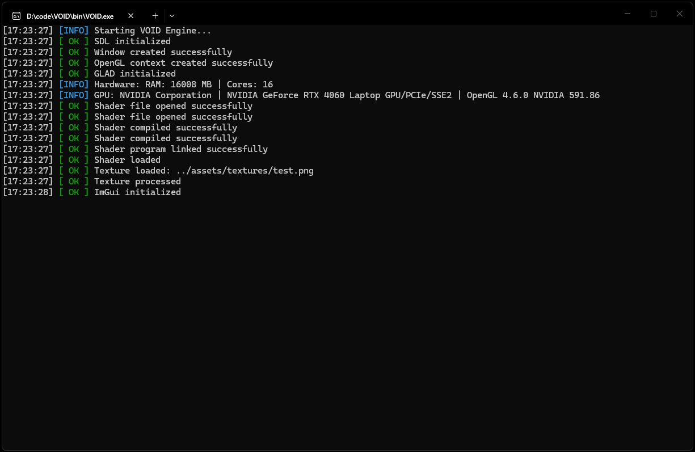

# VOID

<p align="center">


</p>

🇬🇧 English | 🇷🇺 [Русский](README_RU.md)

A lightweight game engine written in modern C++ using SDL3 and OpenGL.

The project is built from scratch to explore graphics programming, rendering techniques, and engine architecture without relying on external game engines. It features a **Raylib-like global API**, making 2D game development fast, clean, and intuitive.


## ✨ Features

- **Raylib-style Global API**: Clean and simple game loops (`InitWindow`, `BeginDrawing`, `EndDrawing`, `IsKeyDown`, etc.)
- **Modular Architecture**: Strictly separated into Window, Input, Graphics, and Utils modules
- **Modern Graphics Pipeline**: OpenGL 4.6 Core Profile with GLAD 2 loader (auto-generated by CMake)
- **Object-Oriented Abstractions**: Encapsulated `Shader`, `Texture`, `Mesh` (VAO/VBO/EBO), and `VertexArray` classes
- **2D Rendering Pipeline**: Dedicated quad-based renderer optimized for sprites and batched drawing workflows
- **Sprite System**: Encapsulates textures, positions, sizes, colors, and rotation
- **Orthographic Camera**: Y-Down coordinate system powered by GLM with dynamic aspect ratio correction
- **Modern Shader Pipeline**: External GLSL files with built-in uniforms (`u_Model`, `u_ViewProj`, `u_Texture`)
- **Input System**: Abstracted keyboard and mouse input (completely hides SDL from the game layer)
- **Texture Loading**: Via `stb_image` with automatic purple/black checkerboard fallback on failure
- **Pixel-Art Friendly**: Default `GL_NEAREST` texture filtering
- **Developer Tools**: Colored, timestamped logging system & Hardware/GPU info reporting
- **Zero-Setup Dependencies**: Automated dependency management through CMake FetchContent (No vcpkg required)
- **Advanced Window System**: Configurable window creation with fullscreen support, high-DPI handling, resizing limits, custom positioning, and OpenGL context configuration
- **VSync Management**: Support for disabled, enabled, and adaptive VSync modes with swap interval control and frame pacing improvements
- **Frame Timing System**: Built-in delta time calculation, FPS counter, frame time tracking, and optional FPS limiting
- **Anti-Aliasing Support**: Hardware MSAA configuration through OpenGL multisampling
- **High Performance GPU Support**: Discrete GPU preference hints for NVIDIA Optimus and AMD PowerXpress laptops
- **Multi-Monitor Awareness**: Automatic detection of active display refresh rates and monitor configuration

## 🛠 Requirements

- Visual Studio 2022+
- CMake 3.25+
- Git
- Python 3+

## 🚀 Build

Configure:

```bash
cmake --preset windows-msvc-debug
```

Build:

```bash
cmake --build build
```

## 🖼 Example

<p align="center">
  
</p>

<p align="center">
  
</p>

_Currently renders textured 2D sprites using a custom Renderer, Sprite and Orthographic Camera system._

## ⚙️ How it works

VOID exposes a lightweight Raylib-inspired API while internally using modern C++20 classes for resource encapsulation and modular engine architecture.

The engine creates an SDL3 window, initializes an OpenGL 4.6 Core Profile context, and loads OpenGL functions through GLAD at runtime. Instead of relying on a heavy `Application` class, the engine provides simple global functions to manage the window, rendering, and input.

Internally, the engine is built around modular components such as:

- Window
- Shader
- Texture
- VertexArray
- Mesh
- Renderer
- Sprite
- OrthographicCamera
- Input
- ImGuiLayer

Game code only includes:

```cpp
#include "void.h"
```

The game layer never directly depends on SDL3, OpenGL, GLAD, or stb_image, keeping the public API clean and easy to use.

## 📂 Project Structure

```text
.
├── assets/
│   └── engine/
│       ├── shaders/
│       │   ├── default.frag
│       │   └── default.vert
│       └── textures/
│           └── test.png
│ 
├── docs/
│   ├── cat.gif
│   ├── example_1.png
│   └── example_2.png
│ 
├── src/
│   ├── engine/                 
│   │   ├── graphics/                
│   │   │   ├── Camera/
│   │   │   │   ├── OrthographicCamera.cpp
│   │   │   │   └── OrthographicCamera.h         
│   │   │   │  
│   │   │   ├── Mesh.cpp
│   │   │   ├── Mesh.h
│   │   │   ├── Renderer.cpp
│   │   │   ├── Renderer.h
│   │   │   ├── Shader.cpp
│   │   │   ├── Shader.h
│   │   │   ├── Sprite.cpp
│   │   │   ├── Sprite.h
│   │   │   ├── Texture.cpp
│   │   │   ├── Texture.h
│   │   │   ├── VertexArray.cpp
│   │   │   └── VertexArray.h
│   │   │
│   │   ├── utils/                   
│   │   │   ├── ConsoleColors.h
│   │   │   ├── Log.cpp
│   │   │   ├── Log.h
│   │   │   ├── SystemInfo.cpp
│   │   │   ├── SystemInfo.h
│   │   │   ├── Time.cpp
│   │   │   └── Time.h
│   │   │
│   │   ├── ImGuiLayer.cpp
│   │   ├── ImGuiLayer.h
│   │   ├── Input.cpp
│   │   ├── Input.h
│   │   ├── Window.cpp
│   │   ├── Window.h
│   │   ├── stb.cpp              
│   │   └── void.h
│
├── CMakeLists.txt
├── CMakePresets.json
├── LICENSE
├── README.md
└── README_RU.md
```

## 🚧 Roadmap

- [x] SDL3 initialization
- [x] OpenGL 4.6 Context
- [x] GLAD2
- [x] Shader loading
- [x] First rendered triangle
- [x] VAO / VBO / EBO
- [x] Texture loading
- [x] Texture fallback
- [x] ImGui integration
- [x] Orthographic camera
- [x] Sprite system
- [x] Shader abstraction
- [x] Texture abstraction
- [x] Mesh abstraction
- [x] VertexArray abstraction
- [x] Modular engine architecture
- [x] Window configuration
- [x] Input system
- [x] Raylib-style API
- [ ] Batch Renderer
- [ ] Font Rendering
- [ ] Asset Manager
- [ ] Scene System
- [ ] Tilemaps
- [ ] Animation System
- [ ] Particle System
- [ ] Post Processing
- [ ] And much more...

## 📖 About

VOID is a personal game engine project focused on learning modern graphics programming, engine architecture, and real-time rendering by building everything from scratch.

The project emphasizes understanding every stage of the graphics pipeline instead of relying on existing game engines. The long-term goal is to build a lightweight, modular, and easy-to-use 2D engine for pixel-art games with a Raylib-inspired API and a modern C++20 implementation.

## 📜 License

MIT

---

<p align="center">
  
</p>