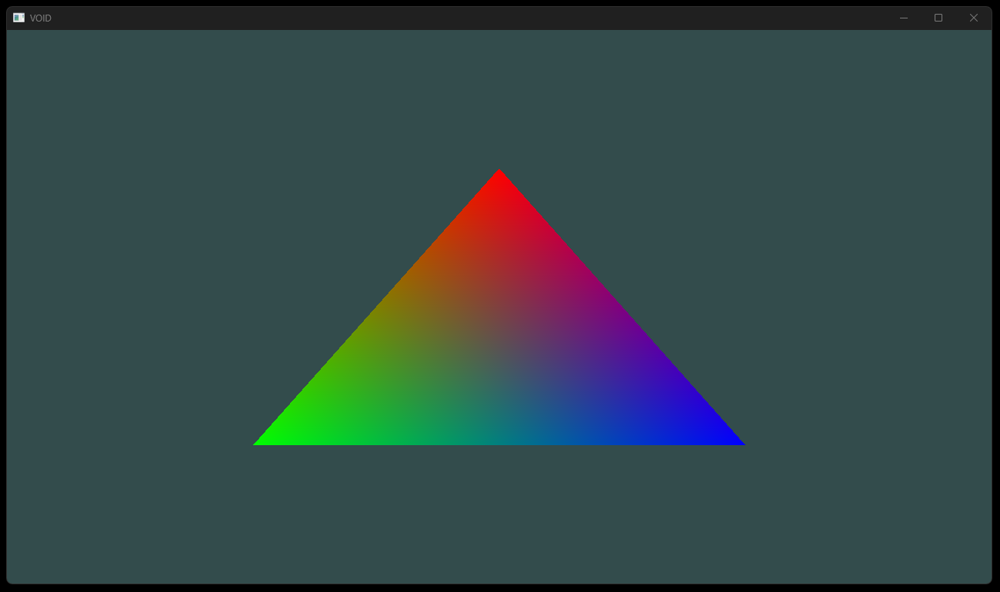
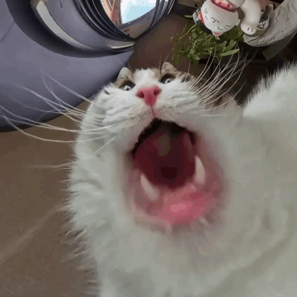

# VOID

<p align="center">


</p>

🇬🇧 English | 🇷🇺 Русский

Лёгкий игровой движок, написанный на современном C++ с использованием SDL3 и OpenGL.

Проект создан с нуля для изучения программирования графики, техник рендеринга и архитектуры игровых движков без использования готовых игровых движков.

## Возможности

- Управление окнами через SDL3
- OpenGL 4.6 Core Profile
- Загрузчик GLAD 2
- Современный шейдерный пайплайн
- Загрузка внешних GLSL-шейдеров
- Система сборки CMake
- Интеграция с vcpkg
- Кроссплатформенная архитектура

## Требования

- Visual Studio 2022+
- CMake 3.25+
- Ninja
- vcpkg

## Сборка

Настройка:

```bash
cmake --preset windows-msvc-vcpkg
```

Сборка:

```bash
cmake --build build
```

## Пример

<p align="center">
  
</p>

_В данный момент движок отображает первый треугольник через современный OpenGL-пайплайн._

## Как это работает

Движок создаёт окно SDL3 и инициализирует контекст OpenGL 4.6 Core Profile.

GLAD загружает функции OpenGL во время выполнения программы.

Шейдеры загружаются из внешних GLSL-файлов, компилируются, связываются в шейдерную программу и используются для отрисовки геометрии.

## Структура проекта

```text
.
├── assets/
│   └── shaders/
│       ├── triangle.vert
│       └── triangle.frag
├── docs/
│   └── example.png
├── extern/
│   ├── include/
│   └── src/
├── src/
│   └── main.cpp
├── CMakeLists.txt
├── CMakePresets.json
├── LICENSE
├── README.md
└── README_RU.md
```

## Дорожная карта

- [x] Инициализация SDL3
- [x] Создание OpenGL-контекста
- [x] Интеграция GLAD 2
- [x] Загрузка шейдеров
- [x] Первый отрисованный треугольник
- [ ] Vertex Buffer Objects (VBO)
- [ ] Vertex Array Objects (VAO)
- [ ] Element Buffer Objects (EBO)
- [ ] Загрузка текстур
- [ ] Камера
- [ ] Загрузка моделей
- [ ] Абстракция рендерера

## О проекте

VOID — это персональный проект по разработке графического движка, направленный на изучение современного OpenGL и создание собственного движка с нуля.

Проект делает акцент на понимании графического пайплайна, а не на использовании готовых рендеринговых фреймворков.

## Лицензия

MIT

---

<p align="center">
  
</p>